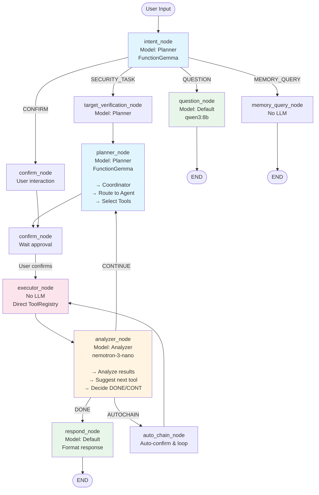
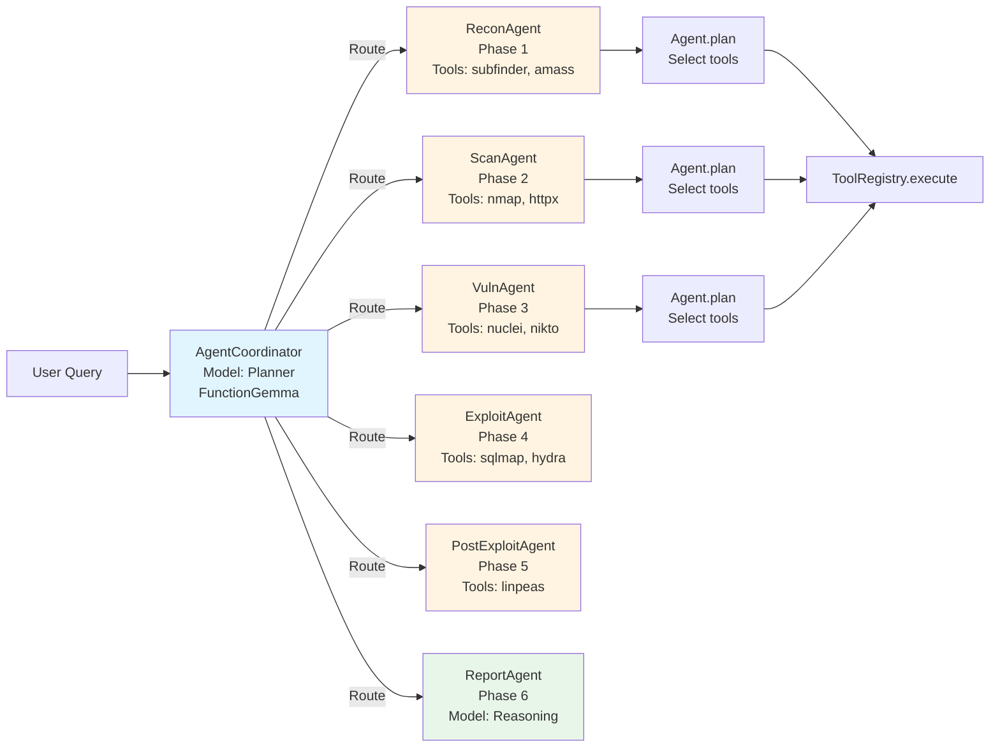

# SNODE Architecture Flow - Models & Agents

## Tổng quan

SNODE sử dụng **Multi-Model Architecture** với **LangGraph State Machine** để xử lý các task penetration testing. Mỗi model được tối ưu cho một task cụ thể.

## Multi-Model Architecture

### Model Classification

| Model Type | Model Name | Task | Speed | Quality |
|------------|-----------|------|-------|---------|
| **Planner** | FunctionGemma, nemotron-mini | Tool selection, planning | ⚡ Fast | ✅ Good |
| **Analyzer** | nemotron-3-nano, deepseek-r1 | Analyze tool outputs | ⚡ Fast / 🐌 Slow | ✅ Good / ⭐ Excellent |
| **Executor** | qwen2.5-coder, codellama | Code/command generation | ⚡ Fast | ✅ Good |
| **Reasoning** | deepseek-r1, qwen3, llama3 | Complex reasoning | 🐌 Slow | ⭐ Excellent |
| **Default** | qwen3:8b, mistral | General tasks, questions | ⚡ Fast | ✅ Good |

### Model Usage Map

```
┌─────────────────────────────────────────────────────────────┐
│                    USER INPUT                                │
└──────────────────────┬──────────────────────────────────────┘
                       │
                       ▼
            ┌──────────────────────┐
            │  Intent Classifier    │
            │  Model: Planner       │
            │  (FunctionGemma)      │
            └───────────┬───────────┘
                        │
        ┌───────────────┼───────────────┐
        │               │               │
        ▼               ▼               ▼
   SECURITY_TASK   QUESTION   MEMORY_QUERY
        │               │               │
        │               └───► Default Model (qwen3:8b)
        │
        ▼
┌──────────────────────┐
│  Target Verification │
│  Model: Planner       │
└───────────┬───────────┘
            │
            ▼
┌──────────────────────┐
│  Planner Node         │
│  Model: Planner       │
│  (FunctionGemma)      │
│                       │
│  → Coordinator        │
│  → Route to Agent     │
│  → Select Tools       │
└───────────┬───────────┘
            │
            ▼
┌──────────────────────┐
│  Confirm Node         │
│  (User approval)      │
└───────────┬───────────┘
            │
            ▼
┌──────────────────────┐
│  Executor Node       │
│  (Tool execution)    │
│  No LLM - Direct     │
│  ToolRegistry call   │
└───────────┬───────────┘
            │
            ▼
┌──────────────────────┐
│  Analyzer Node       │
│  Model: Analyzer     │
│  (nemotron-3-nano)   │
│                       │
│  → Analyze results   │
│  → Suggest next tool │
│  → Decide DONE/CONT  │
└───────────┬───────────┘
            │
    ┌───────┴───────┐
    │               │
    ▼               ▼
  DONE          CONTINUE
    │               │
    │               └───► Back to Planner
    │
    ▼
┌──────────────────────┐
│  Respond Node         │
│  Model: Default       │
│  (Format response)    │
└──────────────────────┘
```

## LangGraph State Machine Flow

### Visual Flow Diagram



### Nodes (Processing Steps)

1. **intent_node** - Classify user intent
   - Model: **Planner** (FunctionGemma/nemotron-mini)
   - Output: `intent` (security_task, question, memory_query, confirm)

2. **target_verification_node** - Verify and resolve target
   - Model: **Planner**
   - Extract domain/IP from query

3. **planner_node** - Plan tools to use
   - Model: **Planner** (FunctionGemma with function calling)
   - Coordinator routes to specialized agent
   - Agent selects tools
   - Output: `suggested_tools`, `suggested_commands`

4. **confirm_node** - Wait for user approval
   - No LLM (user interaction)
   - Auto-confirm in autochain mode

5. **executor_node** - Execute tools
   - No LLM (direct ToolRegistry call)
   - Runs actual security tools
   - Output: `execution_results`

6. **analyzer_node** - Analyze results
   - Model: **Analyzer** (nemotron-3-nano/deepseek-r1)
   - Analyzes tool outputs
   - Suggests next tool
   - Decides DONE/CONTINUE
   - Output: `next_action`, `suggested_tools`

7. **respond_node** - Format and return response
   - Model: **Default** (qwen3:8b)
   - Formats final response

8. **question_node** - Answer simple questions
   - Model: **Default** (qwen3:8b)

9. **memory_query_node** - Query stored data
   - No LLM (direct memory access)

### Agent Coordinator Flow



## Agent System (6-Phase PTES)

### Specialized Agents

1. **ReconAgent** (Phase 1)
   - Tools: amass, subfinder, whois, clatscope, bbot
   - Model: **Planner** for tool selection

2. **ScanAgent** (Phase 2)
   - Tools: nmap, masscan, httpx, gobuster, ffuf
   - Model: **Planner** for tool selection

3. **VulnAgent** (Phase 3)
   - Tools: nuclei, nikto, wpscan, testssl
   - Model: **Planner** for tool selection

4. **ExploitAgent** (Phase 4)
   - Tools: sqlmap, hydra, metasploit, searchsploit
   - Model: **Planner** for tool selection

5. **PostExploitAgent** (Phase 5)
   - Tools: linpeas, mimikatz, bloodhound
   - Model: **Planner** for tool selection

6. **ReportAgent** (Phase 6)
   - Generate reports
   - Model: **Reasoning** (deepseek-r1) for complex reports

### Agent Coordinator

**AgentCoordinator** routes queries to appropriate agent using:
- **Planner Model** (FunctionGemma) for semantic routing
- Context analysis (what data we have)
- Phase inference (where we are in PTES)

**Routing Logic:**
```
User Query
    │
    ▼
Coordinator.route() (Planner Model)
    │
    ├─► Has shell? → PostExploitAgent
    ├─► Has vulns? → ExploitAgent
    ├─► Has ports? → VulnAgent
    ├─► Has subdomains? → ScanAgent
    └─► Default → ReconAgent
```

## Model Selection Logic

### Intent Classification
- **Model**: Planner (FunctionGemma/nemotron-mini)
- **Why**: Fast, good at function calling
- **Location**: `intent_classifier_tool.py`

### Planning (Tool Selection)
- **Model**: Planner (FunctionGemma with function calling)
- **Why**: Native function calling support
- **Location**: `coordinator.py`, `planner_tool.py`

### Analysis (Result Analysis)
- **Model**: Analyzer (nemotron-3-nano/deepseek-r1)
- **Why**: Need reasoning but can use lightweight for speed
- **Location**: `analyzer_tool.py`

### Question Answering
- **Model**: Default (qwen3:8b)
- **Why**: Fast, good for simple tasks
- **Location**: `question_tool.py`

### Complex Reasoning
- **Model**: Reasoning (deepseek-r1)
- **Why**: Need deep reasoning
- **Location**: `base_agent.py` (is_complete method)

## AutoChain Mode

Khi user enable autochain mode:
1. Auto-confirm suggestions
2. Run up to 5 iterations
3. Small analyze for iterations 0-4
4. Comprehensive analyze for iteration 5
5. Auto-select next tools based on analyzer recommendations

## Example Flow

### User: "attack hellogroup.com"

```
1. intent_node (Planner: FunctionGemma)
   → Intent: SECURITY_TASK

2. target_verification_node (Planner)
   → Target: hellogroup.com

3. planner_node (Planner: FunctionGemma)
   → Coordinator routes to ReconAgent
   → ReconAgent selects: [subfinder, amass]
   → Suggestion: "I'll enumerate subdomains for hellogroup.com"

4. confirm_node
   → User: "yes" (or auto-confirm in autochain)

5. executor_node
   → Run: subfinder -d hellogroup.com
   → Run: amass enum -d hellogroup.com
   → Results: [sub1.hellogroup.com, sub2.hellogroup.com, ...]

6. analyzer_node (Analyzer: nemotron-3-nano)
   → Analysis: "Found 15 subdomains. Next: port scan"
   → Next tool: nmap
   → Next action: CONTINUE

7. planner_node (Planner: FunctionGemma)
   → Coordinator routes to ScanAgent
   → ScanAgent selects: [nmap]
   → Loop back to executor...

8. analyzer_node (Analyzer)
   → Analysis: "Port scan complete. Next: vulnerability scan"
   → Next tool: nuclei
   → ...

9. respond_node (Default: qwen3:8b)
   → Format final response
   → END
```

## Key Design Principles

1. **LLM Plans, CODE Executes**
   - LLM selects tools (planner model)
   - Code executes tools (no LLM)
   - LLM analyzes results (analyzer model)

2. **Multi-Model for Performance**
   - Fast models for simple tasks (planner, default)
   - Slow models only when needed (analyzer, reasoning)

3. **Specialized Agents**
   - Each agent handles one PTES phase
   - Coordinator routes based on context

4. **State Persistence**
   - LangGraph MemorySaver persists state
   - Context accumulates across turns

5. **Validation Layer**
   - PlanValidator checks plans before execution
   - ToolValidator checks tool parameters
   - FallbackManager suggests alternatives

## Configuration

Models are configured in `app/llm/config.json`:
```json
{
  "model": "qwen3:8b",              // Default
  "planner_model": "functiongemma", // Planner
  "analyzer_model": "nemotron-3-nano", // Analyzer
  "executor_model": null,           // Executor (not used yet)
  "reasoning_model": "deepseek-r1"  // Reasoning
}
```

Change models via CLI:
```bash
/model planner functiongemma
/model analyzer nemotron-3-nano
/model reasoning deepseek-r1
```
