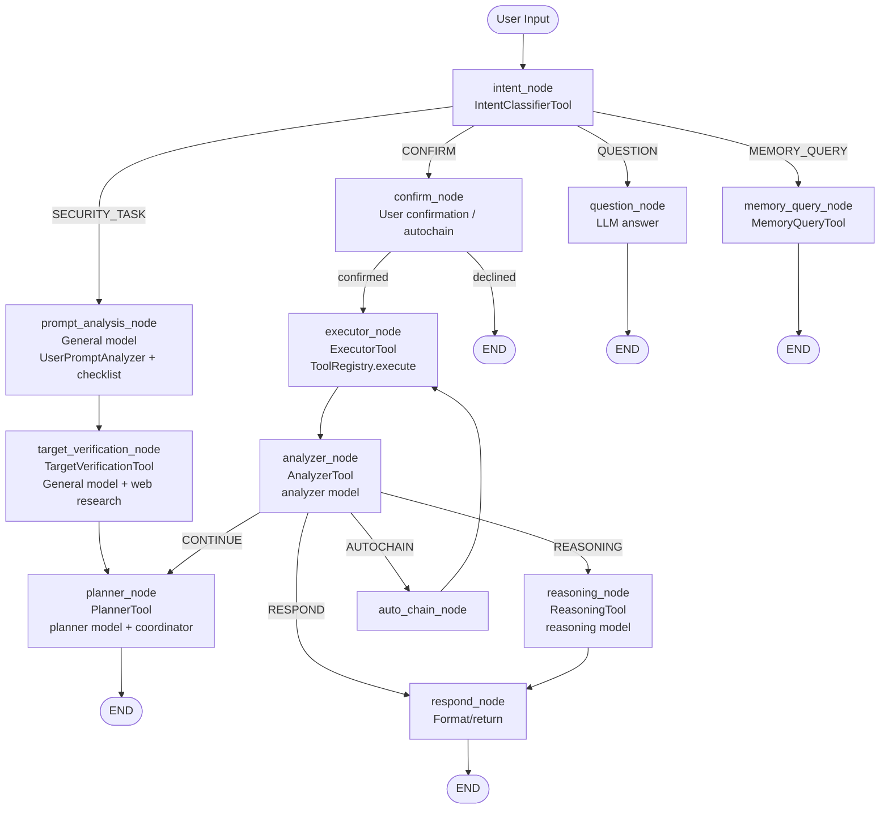
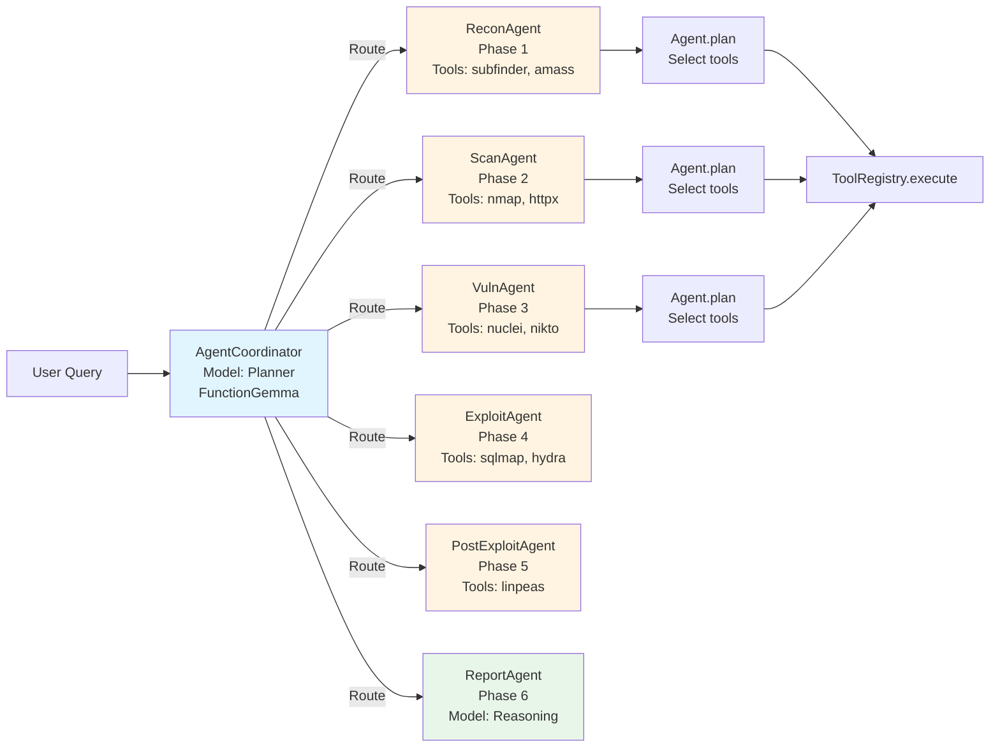

# SNODE Architecture Flow - Current (Models, Graph, Agents)

## Tổng quan

SNODE sử dụng **LangGraph State Machine** để điều phối luồng tác vụ pentest, kết hợp **multi-model** (các vai trò `general/planner/analyzer/reasoning/default`) để tối ưu tốc độ và chất lượng theo từng bước trong pipeline.

## Multi-Model Architecture

### Model Classification

| Model Role | Ví dụ model | Nhiệm vụ | Ghi chú |
|------------|------------|----------|---------|
| **general** | qwen3:8b, nemotron-mini | Prompt analysis, checklist/task breakdown, entity/target extraction | Dùng cho “hiểu yêu cầu” và tạo checklist |
| **planner** | functiongemma, nemotron-mini | Tool selection, routing agent, planning | Có thể dùng function calling (tuỳ model) |
| **analyzer** | nemotron-3-nano, deepseek-r1 | Analyze tool outputs, next-step suggestion | Có thể chậm nếu dùng model reasoning-heavy |
| **reasoning** | deepseek-r1, qwen3, llama3 | Deep reasoning / final synthesis | Thường chậm nhất |
| **executor** | qwen2.5-coder, codellama | Code/command generation (optional) | Không phải core-path bắt buộc |
| **default** | qwen3:8b, mistral | General responses / fallback | Fallback khi role-specific model chưa set |

> Lưu ý: tên model thật sự được cấu hình trong `app/llm/config.json` và có cơ chế auto-detect nếu chưa set.

### Model Usage Map

```
┌─────────────────────────────────────────────────────────────┐
│                    USER INPUT                                │
└──────────────────────┬──────────────────────────────────────┘
                       │
                       ▼
            ┌──────────────────────────────┐
            │  intent_node                  │
            │  Intent classification         │
            │  (LLM via intelligence layer)  │
            └───────────┬───────────────────┘
                        │
        ┌───────────────┼───────────────┐
        │               │               │
        ▼               ▼               ▼
   SECURITY_TASK     CONFIRM      QUESTION      MEMORY_QUERY
        │              │            │              │
        │              │            └───► question_node (LLM answer)
        │
        ├──────────────► prompt_analysis_node (general model)
        │                 └─ create checklist/tasks
        │
        ├──────────────► target_verification_node (general model + web research as needed)
        │
        ├──────────────► planner_node (planner model + coordinator + validators)
        │                 └─ produces suggestion_message + suggested_tools
        │
        ├──────────────► respond_node (returns suggestion/response text)
        │
        ├──────────────► confirm_node (user approval / autochain)
        │
        ├──────────────► executor_node (code; ToolRegistry executes tools)
        │
        └──────────────► analyzer_node (analyzer model)
                          ├─ CONTINUE → back to planner_node
                          ├─ REASONING → reasoning_node → respond_node
                          └─ DONE/RESPOND → respond_node
```

## LangGraph State Machine Flow

### Visual Flow Diagram



### Nodes (Processing Steps)

1. **intent_node** - Classify user intent
   - Tool: `IntentClassifierTool` (intelligence layer + LLM)
   - Output: `intent` (`security_task`, `confirm`, `question`, `memory_query`)

2. **prompt_analysis_node** - Analyze prompt & (optionally) create checklist
   - Model role: **general**
   - `UserPromptAnalyzer` phân tích yêu cầu + tạo checklist (re-use `TaskBreakdownTool`)

3. **target_verification_node** - Verify/resolve target
   - Model role: **general**
   - Tool: `TargetVerificationTool` (có web research khi cần)

4. **planner_node** - Plan tools to use
   - Model role: **planner**
   - Coordinator routes to specialized agent + select tools/commands
   - Output chính: `suggested_tools`, `suggested_commands`, `suggestion_message`

5. **confirm_node** - Handle user approval
   - No LLM (user interaction / mode handling)

6. **executor_node** - Execute tools
   - No LLM (ToolRegistry execute via handler/CLI)
   - Output: `execution_results` + context updates

7. **analyzer_node** - Analyze results
   - Model role: **analyzer**
   - Output: `next_action` (continue/respond/reasoning/auto_chain) + context hints

8. **reasoning_node** - Deep synthesis
   - Model role: **reasoning**

9. **respond_node** - Return response/suggestion
   - Chủ yếu return/format nội dung có sẵn trong state (không bắt buộc gọi LLM)

10. **question_node** - Answer simple questions
   - Model: `default` (hoặc theo config)

11. **memory_query_node** - Query stored data
   - No LLM bắt buộc (truy vấn memory/RAG)

### Agent Coordinator Flow



## Agent System (6-Phase PTES)

### Specialized Agents

1. **ReconAgent** (Phase 1)
   - Tools: amass, subfinder, whois, clatscope, bbot
   - Model: **Planner** for tool selection

2. **ScanAgent** (Phase 2)
   - Tools: nmap, masscan, httpx, gobuster, ffuf
   - Model: **Planner** for tool selection

3. **VulnAgent** (Phase 3)
   - Tools: nuclei, nikto, wpscan, testssl
   - Model: **Planner** for tool selection

4. **ExploitAgent** (Phase 4)
   - Tools: sqlmap, hydra, metasploit, searchsploit
   - Model: **Planner** for tool selection

5. **PostExploitAgent** (Phase 5)
   - Tools: linpeas, mimikatz, bloodhound
   - Model: **Planner** for tool selection

6. **ReportAgent** (Phase 6)
   - Generate reports
   - Model: **Reasoning** (deepseek-r1) for complex reports

### Agent Coordinator

**AgentCoordinator** routes queries to appropriate agent using:
- **Planner model role** (configurable) for semantic routing
- Context analysis (what data we have)
- Phase inference (where we are in PTES)

**Routing Logic:**
```
User Query
    │
    ▼
Coordinator.route() (planner model role)
    │
    ├─► Has shell? → PostExploitAgent
    ├─► Has vulns? → ExploitAgent
    ├─► Has ports? → VulnAgent
    ├─► Has subdomains? → ScanAgent
    └─► Default → ReconAgent
```

## Model Selection Logic

### Intent Classification
- **Model role**: `default` / `general` (thông qua intelligence layer)
- **Why**: cần hiểu câu hỏi + context để phân loại intent ổn định
- **Location**: `app/agent/tools/intent_classifier_tool.py`, `app/agent/intelligence.py`

### Prompt Analysis + Checklist (Task Breakdown)
- **Model role**: `general`
- **Why**: trích xuất yêu cầu, tạo checklist/task breakdown, xử lý prompt “mơ hồ”
- **Location**: `app/agent/analyzer/user_prompt_analyzer.py`, `app/agent/analyzer/task_breakdown_tool.py`

### Target Verification
- **Model role**: `general`
- **Why**: resolve target domain/IP, có thể cần web research
- **Location**: `app/agent/analyzer/target_verification_tool.py`

### Planning (Tool Selection)
- **Model role**: `planner`
- **Why**: routing agent + chọn tool/command (có thể function calling tuỳ model)
- **Location**: `app/agent/tools/planner_tool.py`, `app/agent/orchestration/*`

### Execution (Tool Run)
- **Model**: None (code path)
- **Why**: chạy tool thật qua registry/handler
- **Location**: `app/agent/tools/executor_tool.py`, `app/tools/registry.py`

### Analysis (Result Analysis)
- **Model role**: `analyzer`
- **Why**: parse & reason trên output tool, đề xuất bước tiếp theo
- **Location**: `app/agent/tools/analyzer_tool.py`

### Question Answering
- **Model role**: `default`
- **Why**: trả lời nhanh các câu hỏi/giải thích
- **Location**: `app/agent/tools/question_tool.py`

### Complex Reasoning
- **Model role**: `reasoning`
- **Why**: tổng hợp sâu (khi checklist complete hoặc cần kết luận)
- **Location**: `app/agent/tools/reasoning_tool.py`

## AutoChain Mode

Khi user enable autochain mode:
1. Auto-confirm suggestions
2. Run up to 5 iterations
3. Small analyze for iterations 0-4
4. Comprehensive analyze for iteration 5
5. Auto-select next tools based on analyzer recommendations

## Example Flow

### User: "attack hellogroup.com"

```
1. intent_node (intent classification)
   → Intent: SECURITY_TASK

2. prompt_analysis_node (general model)
   → Analyze prompt + create checklist (if needed)

3. target_verification_node (general model)
   → Target resolved: hellogroup.com

4. planner_node (planner model)
   → Coordinator routes to ReconAgent
   → ReconAgent selects: [subfinder, amass]
   → Suggestion: "I'll enumerate subdomains for hellogroup.com"

5. User replies "yes"
   → intent_node returns CONFIRM
   → confirm_node sets confirmed=True and selected_tools

6. executor_node
   → Run: subfinder -d hellogroup.com
   → Run: amass enum -d hellogroup.com
   → Results: [sub1.hellogroup.com, sub2.hellogroup.com, ...]

7. analyzer_node (analyzer model)
   → Analysis: "Found 15 subdomains. Next: port scan"
   → Next tool: nmap
   → Next action: CONTINUE

8. planner_node (planner model)
   → Coordinator routes to ScanAgent
   → ScanAgent selects: [nmap]
   → Loop back to executor...

9. analyzer_node (analyzer model)
   → Analysis: "Port scan complete. Next: vulnerability scan"
   → Next tool: nuclei
   → ...

10. respond_node
   → Return final response text to CLI
   → END
```

## Key Design Principles

1. **LLM Plans, CODE Executes**
   - LLM selects tools (planner model)
   - Code executes tools (no LLM)
   - LLM analyzes results (analyzer model)

2. **Multi-Model for Performance**
   - Fast models for simple tasks (planner, default)
   - Slow models only when needed (analyzer, reasoning)

3. **Specialized Agents**
   - Each agent handles one PTES phase
   - Coordinator routes based on context

4. **State Persistence**
   - LangGraph MemorySaver persists state
   - Context accumulates across turns

5. **Validation Layer**
   - PlanValidator checks plans before execution
   - ToolValidator checks tool parameters
   - FallbackManager suggests alternatives

## Configuration

Models are configured in `app/llm/config.json`:
```json
{
  "provider": "ollama",
  "model": "qwen3:8b",
  "general_model": null,
  "planner_model": null,
  "analyzer_model": null,
  "executor_model": null,
  "reasoning_model": null,
  "temperature": 0,
  "endpoint": "http://localhost:11434"
}
```

Change models via CLI:
```bash
/model planner functiongemma
/model general qwen3:8b
/model analyzer nemotron-3-nano
/model executor qwen2.5-coder
/model reasoning deepseek-r1
```

> Note: This document is being updated to match the current runtime flow (`prompt_analysis_node`, checklist integration, and updated routing). If you see mismatches, treat the LangGraph implementation in `app/agent/graph.py` as the source of truth.
