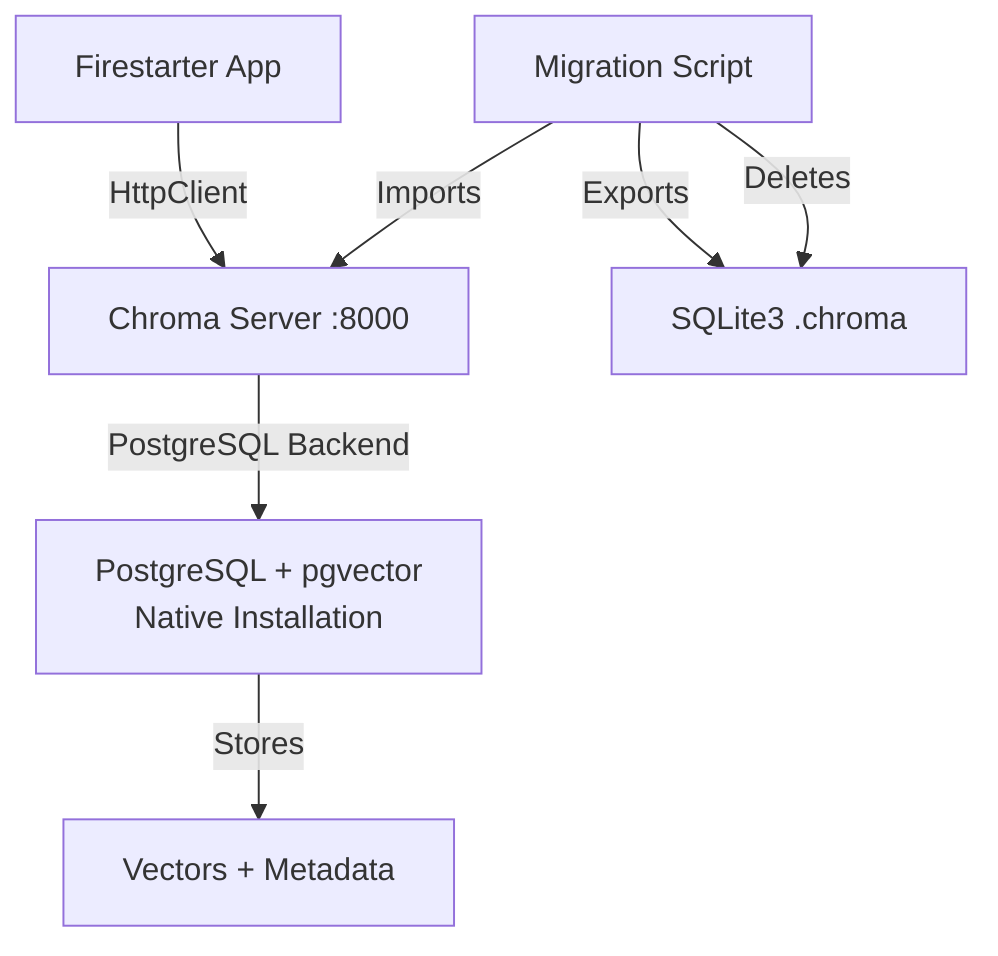

# Migration ChromaDB từ SQLite3 sang PostgreSQL + pgvector (Native Setup)

## Mục tiêu

Chuyển ChromaDB từ SQLite3 sang PostgreSQL + pgvector backend thông qua Chroma Server với native setup (không dùng Docker). Loại bỏ hoàn toàn SQLite3 code và files.

## Kiến trúc mới

## Implementation Steps

### 1. Setup PostgreSQL + pgvector (Native)

#### 1.1 Installation guide

- File: `docs/POSTGRESQL_SETUP.md`
- Hướng dẫn cài đặt PostgreSQL trên Linux
- Cài đặt pgvector extension
- Tạo database và user cho Chroma
- Configuration cho production

#### 1.2 Setup Chroma Server (Native)

- File: `docs/CHROMA_SERVER_SETUP.md`
- Hướng dẫn cài đặt Chroma Server từ source hoặc pip
- Configuration để kết nối với PostgreSQL
- Systemd service file cho auto-start
- Environment variables configuration

### 2. Migration Script

#### 2.1 Tạo migration script

- File: `scripts/migrate_chroma_sqlite_to_postgres.py`
- Export data từ SQLite3:
  - List all collections từ `.chroma` directory
  - Export embeddings, documents, metadatas, ids
  - Save to temporary format (JSON) nếu cần
- Import vào Chroma Server (PostgreSQL backend):
  - Connect to Chroma Server
  - Recreate collections
  - Import data với same IDs
  - Verify data integrity
- **Xóa SQLite3 files sau khi migration thành công**

#### 2.2 Backup script (optional)

- File: `scripts/backup_chroma_sqlite.py`
- Backup SQLite3 database trước khi migrate
- Verify backup integrity

### 3. Code Updates - Remove SQLite3

#### 3.1 Update `rag/vectorstore.py`

- **Loại bỏ hoàn toàn SQLite3 code**
- Chỉ giữ lại Chroma Server (HttpClient) mode
- Remove `PersistentClient` và SQLite3 logic
- Remove `persist_directory` parameter
- Default `use_server=True` (không còn option)
- Better error handling khi Chroma Server không available
- Health check method để verify Chroma Server connection

#### 3.2 Update all ChromaVectorStore usages

- Remove `persist_directory` parameters từ tất cả calls
- Ensure tất cả đều dùng Chroma Server

#### 3.3 Update initialization

- Check Chroma Server connection on startup
- Fail fast nếu server không available
- Clear error messages

### 4. Cleanup SQLite3

#### 4.1 Remove SQLite3 files

- Delete `.chroma/` directory và contents
- Update `.gitignore` để ignore `.chroma/` nếu còn

#### 4.2 Remove SQLite3 dependencies

- Check `requirements.txt` - chromadb vẫn cần nhưng không dùng SQLite3 mode
- Update documentation

### 5. Configuration Updates

#### 5.1 Update `.env.example`

- Remove SQLite3 related variables
- Thêm required variables:
  - `CHROMA_SERVER_HOST=localhost` (required)
  - `CHROMA_SERVER_PORT=8000` (required)
  - `CHROMA_SERVER_AUTH_TOKEN=<secure-token>` (optional but recommended)
  - `POSTGRES_HOST=localhost` (for reference)
  - `POSTGRES_PORT=5432` (for reference)
  - `POSTGRES_DB=chroma` (for reference)
  - `POSTGRES_USER=chroma` (for reference)
  - `POSTGRES_PASSWORD=<secure-password>` (for reference)

#### 5.2 Update setup scripts

- `setup.sh`: Remove SQLite3 directory creation
- Add PostgreSQL connection check
- Add Chroma Server connection check

### 6. Documentation

#### 6.1 Update `README.md`

- Remove SQLite3 references
- Thêm PostgreSQL + Chroma Server setup section
- Native installation instructions
- Migration guide

#### 6.2 Update `QUICKSTART.md`

- Remove SQLite3 setup steps
- Thêm PostgreSQL + Chroma Server setup steps
- Prerequisites: PostgreSQL installed

#### 6.3 Tạo `docs/POSTGRESQL_SETUP.md`

- Chi tiết cài đặt PostgreSQL trên Ubuntu/Debian/CentOS
- Cài đặt pgvector extension
- Database và user creation
- Configuration cho production

#### 6.4 Tạo `docs/CHROMA_SERVER_SETUP.md`

- Cài đặt Chroma Server (pip hoặc từ source)
- Configuration để dùng PostgreSQL backend
- Systemd service setup
- Environment variables
- Troubleshooting

### 7. Testing & Validation

#### 7.1 Test migration script

- Test với sample data
- Verify data integrity sau migration
- Verify SQLite3 files được xóa

#### 7.2 Test Chroma Server connection

- Connection pooling
- Error handling
- Retry logic
- Health checks

## Files cần tạo/sửa

1. **`scripts/migrate_chroma_sqlite_to_postgres.py`** - Migration script (export + import + delete SQLite3)
2. **`scripts/backup_chroma_sqlite.py`** - Backup script (optional)
3. **`rag/vectorstore.py`** - Remove SQLite3, chỉ dùng Chroma Server
4. **`.env.example`** - Update với PostgreSQL + Chroma Server config (remove SQLite3)
5. **`setup.sh`** - Remove SQLite3 setup, add PostgreSQL/Chroma Server checks
6. **`README.md`** - Update với PostgreSQL native setup
7. **`QUICKSTART.md`** - Update với PostgreSQL prerequisites
8. **`docs/POSTGRESQL_SETUP.md`** - PostgreSQL native installation guide
9. **`docs/CHROMA_SERVER_SETUP.md`** - Chroma Server native setup guide
10. **`.gitignore`** - Ensure `.chroma/` is ignored

## Migration Path

1. **Setup PostgreSQL + pgvector** (native installation)
2. **Setup Chroma Server** (native installation, kết nối PostgreSQL)
3. **Run migration script** để move data từ SQLite3 sang PostgreSQL
4. **Verify data integrity**
5. **Delete SQLite3 files** (`.chroma/` directory)
6. **Update code** để remove SQLite3 support
7. **Test application** với PostgreSQL backend

## Breaking Changes

- **SQLite3 support hoàn toàn bị loại bỏ** - không còn fallback
- **Chroma Server là bắt buộc** - application sẽ fail nếu server không available
- **PostgreSQL là requirement** - phải cài đặt trước khi chạy application

## Lợi ích

1. **Production Ready**: PostgreSQL phù hợp cho production với ACID compliance
2. **No Docker dependency**: Native setup, dễ quản lý và monitor
3. **Scalability**: Hỗ trợ concurrent writes, horizontal scaling
4. **Reliability**: Backup, replication, HA support
5. **Performance**: pgvector extension tối ưu cho vector search
6. **Clean codebase**: Loại bỏ SQLite3 code, đơn giản hóa maintenance