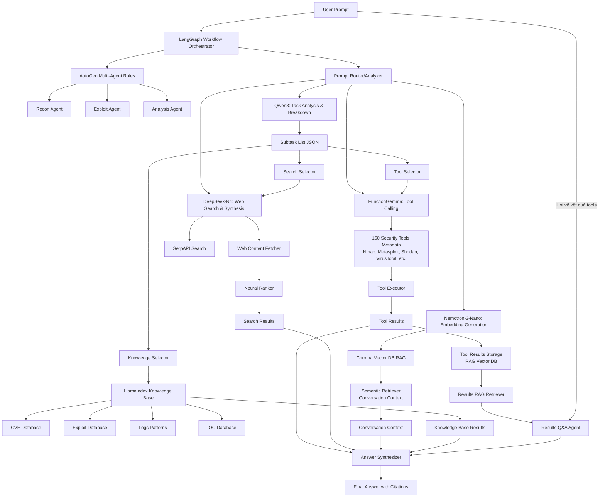

# Kế hoạch xây dựng AI Pentest Agent Multi-Model

## Kiến trúc tổng thể



## Phân công vai trò models và components

### Models (Ollama)

- **Qwen3**: Task analysis, breakdown user prompt thành subtasks, xác định tool/search/knowledge cần thiết
- **FunctionGemma**: Function calling chuyên biệt, gọi security tools dựa trên semantic understanding
- **DeepSeek-R1**: Web search orchestration, content extraction, cross-verification, answer synthesis
- **Nemotron-3-Nano**: Embedding generation cho RAG, vector search, semantic similarity

### Multi-Agent Framework

- **AutoGen**: Multi-agent roles coordination với tools chuyên ngành
  - **Recon Agent**: Chuyên về reconnaissance tasks (network scanning, OSINT)
    - **Tools**: Nmap, Shodan, DNS enumeration, subdomain discovery, port scanning tools
    - **Model**: Qwen3 hoặc FunctionGemma
  - **Exploit Agent**: Chuyên về exploit research và execution
    - **Tools**: Metasploit, exploit frameworks, vulnerability scanners, payload generators
    - **Model**: DeepSeek-R1
  - **Analysis Agent**: Phân tích kết quả, vulnerability assessment
    - **Tools**: VirusTotal, log analyzers, IOC checkers, threat intelligence tools
    - **Model**: Qwen3
  - **Results Q&A Agent**: Trả lời câu hỏi về tool results đã chạy
    - **Capability**: Query tool results từ RAG, phân tích chi tiết kết quả
    - **Model**: Qwen3 hoặc DeepSeek-R1

### Knowledge Base

- **LlamaIndex**: Structured knowledge retrieval cho CVE, exploits, logs patterns, IOC
- **RAG (Chroma)**: 
  - **Conversation Context**: Lịch sử hội thoại, user preferences
  - **Tool Results**: Kết quả tools đã chạy với metadata (tool name, timestamp, parameters, full results) để hỗ trợ Q&A về results

## Cấu trúc thư mục

```
firestarter/
├── config/
│   ├── models.yaml              # Config cho 4 models
│   ├── ollama_config.yaml       # Ollama connection config
│   └── autogen_config.yaml      # AutoGen agent configs
├── prompts/
│   ├── qwen3_system.jinja2      # System prompt cho Qwen3
│   ├── functiongemma_system.jinja2
│   ├── deepseek_system.jinja2
│   ├── nemotron_system.jinja2
│   ├── autogen_recon.jinja2     # AutoGen recon agent prompt
│   ├── autogen_exploit.jinja2   # AutoGen exploit agent prompt
│   ├── autogen_analysis.jinja2  # AutoGen analysis agent prompt
│   └── base_templates.jinja2    # Shared templates
├── tools/
│   ├── __init__.py
│   ├── registry.py              # Tool registry với 150 tools metadata
│   ├── executor.py              # Tool execution engine
│   ├── implementations/         # Core tools implementations
│   │   ├── nmap_tool.py
│   │   ├── metasploit_tool.py
│   │   ├── shodan_tool.py
│   │   └── virustotal_tool.py
│   └── metadata/
│       └── tools.json           # 150 tools definitions (JSON schema)
├── models/
│   ├── __init__.py
│   ├── qwen3_agent.py
│   ├── functiongemma_agent.py   # Chi tiết implementation
│   ├── deepseek_agent.py
│   └── nemotron_agent.py
├── rag/
│   ├── __init__.py
│   ├── vectorstore.py           # Chroma/FAISS setup
│   ├── retriever.py             # Semantic retriever cho conversation
│   ├── results_retriever.py     # Specialized retriever cho tool results
│   ├── results_storage.py       # Tool results storage với metadata
│   └── embeddings.py            # Nemotron embedding wrapper
├── knowledge/
│   ├── __init__.py
│   ├── llamaindex_setup.py      # LlamaIndex initialization
│   ├── cve_index.py             # CVE database index
│   ├── exploit_index.py         # Exploit database index
│   ├── logs_index.py            # Logs patterns index
│   ├── ioc_index.py             # IOC database index
│   └── data/                     # Knowledge base data files
│       ├── cve/
│       ├── exploits/
│       ├── logs/
│       └── ioc/
├── websearch/
│   ├── __init__.py
│   ├── serpapi_client.py        # SerpAPI integration
│   ├── fetcher.py               # Web content fetching
│   ├── ranker.py                # Neural ranking
│   ├── verifier.py              # Cross-source verification
│   └── aggregator.py            # Search aggregation
├── agents/
│   ├── __init__.py
│   ├── router.py                # Prompt router/analyzer
│   ├── synthesizer.py           # Answer synthesis
│   ├── autogen_agents.py        # AutoGen multi-agent setup với tool assignments
│   ├── results_qa_agent.py      # Results Q&A Agent cho tool results queries
│   └── pentest_graph.py         # LangGraph workflow (primary)
├── main.py                      # Entry point
├── requirements.txt
└── README.md
```

## Implementation details

### 1. Tool Registry (150 tools metadata)

File `tools/metadata/tools.json` chứa định nghĩa 150 security tools theo JSON schema, bao gồm các core tools:

**Core Tools (priority implementations):**

- **Nmap**: Network port scanning và service detection
- **Metasploit**: Exploit framework integration
- **Shodan**: Internet-connected device search
- **VirusTotal**: Malware và IOC analysis
- **Web Search API**: SerpAPI integration
```json
{
  "tools": [
    {
      {
      "name": "nmap_scan",
      "description": "Performs comprehensive network port scanning and service detection using Nmap",
      "category": "recon",
      "priority": true,
      "assigned_agents": ["recon_agent"],
      "implementation": "tools.implementations.nmap_tool.execute",
      "parameters": {
        "type": "object",
        "properties": {
          "target": {"type": "string", "description": "IP address or hostname to scan"},
          "ports": {"type": "string", "description": "Port range or specific ports"},
          "options": {"type": "string", "description": "Additional nmap options"}
        },
        "required": ["target"]
      },
      "risk_level": "low",
      "requires_auth": false
    },
    {
      "name": "metasploit_exploit",
      "description": "Execute Metasploit exploit modules",
      "category": "exploitation",
      "priority": true,
      "assigned_agents": ["exploit_agent"],
      "implementation": "tools.implementations.metasploit_tool.execute",
      "parameters": {
        "type": "object",
        "properties": {
          "module": {"type": "string", "description": "Metasploit module name"},
          "target": {"type": "string", "description": "Target IP or hostname"},
          "options": {"type": "object", "description": "Module-specific options"}
        },
        "required": ["module", "target"]
      },
      "risk_level": "high",
      "requires_auth": true
    },
    {
      "name": "shodan_search",
      "description": "Search Shodan for internet-connected devices and services",
      "category": "osint",
      "priority": true,
      "assigned_agents": ["recon_agent"],
      "implementation": "tools.implementations.shodan_tool.search",
      "parameters": {
        "type": "object",
        "properties": {
          "query": {"type": "string", "description": "Shodan search query"},
          "filters": {"type": "object", "description": "Additional search filters"}
        },
        "required": ["query"]
      },
      "risk_level": "low",
      "requires_auth": true
    },
    {
      "name": "virustotal_scan",
      "description": "Scan file, URL, or hash with VirusTotal",
      "category": "malware_analysis",
      "priority": true,
      "assigned_agents": ["analysis_agent"],
      "implementation": "tools.implementations.virustotal_tool.scan",
      "parameters": {
        "type": "object",
        "properties": {
          "resource": {"type": "string", "description": "File hash, URL, or IP address"},
          "resource_type": {"type": "string", "enum": ["hash", "url", "ip"], "description": "Type of resource"}
        },
        "required": ["resource", "resource_type"]
      },
      "risk_level": "low",
      "requires_auth": true
    }
    // ... 146 tools khác
  ]
}
```


### 2. FunctionGemma Integration (chi tiết)

File `models/functiongemma_agent.py`:

- Sử dụng `ollama.chat()` với `tools` parameter
- Parse `tool_calls` từ response
- Execute tools và append tool results vào conversation
- Multi-turn tool calling support

### 3. AutoGen Multi-Agent Setup với Tool Assignments

File `agents/autogen_agents.py`:

- **Recon Agent**: 
  - Chuyên về reconnaissance, sử dụng Qwen3 hoặc FunctionGemma
  - **Assigned Tools**: Nmap, Shodan, DNS enumeration, subdomain discovery, port scanners, OSINT tools
  - Chỉ có quyền truy cập tools trong category "recon" và "osint"

- **Exploit Agent**: 
  - Chuyên về exploit research, sử dụng DeepSeek-R1
  - **Assigned Tools**: Metasploit, exploit frameworks, vulnerability scanners, payload generators, exploitation tools
  - Chỉ có quyền truy cập tools trong category "exploitation" và "vulnerability"

- **Analysis Agent**: 
  - Phân tích kết quả, sử dụng Qwen3
  - **Assigned Tools**: VirusTotal, log analyzers, IOC checkers, threat intelligence, analysis tools
  - Chỉ có quyền truy cập tools trong category "malware_analysis", "threat_intel", "analysis"

- **Results Q&A Agent**:
  - Trả lời câu hỏi về tool results đã chạy
  - Không có tools riêng, chỉ query từ Results RAG
  - Sử dụng Qwen3 hoặc DeepSeek-R1

AutoGen agents hoạt động như specialized roles với tool permissions, được LangGraph điều phối.

### 4. LangGraph Workflow (Primary Orchestration)

File `agents/pentest_graph.py`:

- **Node 1**: Analysis (Qwen3) - breakdown prompt, xác định agent roles cần thiết
- **Node 2**: AutoGen Agent Selection - route đến recon/exploit/analysis agent với tool permissions
- **Node 3**: Tool Selection (FunctionGemma) - semantic tool matching, filter theo agent permissions
- **Node 4**: Tool Execution - execute tools và lưu results vào Results Storage
- **Node 5**: Web Search (DeepSeek-R1) - search aggregation
- **Node 6**: LlamaIndex Retrieval - CVE/exploit/IOC knowledge lookup
- **Node 7**: RAG Retrieval (Nemotron) - conversation context vector search
- **Node 8**: Results Q&A Check - nếu user hỏi về results, route đến Results Q&A Agent
- **Node 9**: Synthesis - combine all results từ tools, search, knowledge base, context, và results Q&A

### 5. LlamaIndex Knowledge Base Setup

File `knowledge/llamaindex_setup.py`:

- **CVE Database**: Index CVE entries với metadata (severity, affected products, CVSS scores)
- **Exploit Database**: Index exploit code, PoCs, và exploitation techniques
- **Logs Patterns**: Index log patterns cho detection và analysis
- **IOC Database**: Index Indicators of Compromise (hashes, IPs, domains, file paths)

LlamaIndex sử dụng structured retrieval cho knowledge queries, khác với RAG cho conversation context.

### 6. Tool Results Storage & Retrieval

File `rag/results_storage.py`:

- **Storage Format**: Mỗi tool result được lưu với metadata:
  ```json
  {
    "tool_name": "nmap_scan",
    "timestamp": "2025-01-XX...",
    "parameters": {"target": "192.168.1.1", "ports": "1-1000"},
    "results": "...",
    "agent": "recon_agent",
    "session_id": "..."
  }
  ```

- **Vector Embedding**: Results được embed bằng Nemotron-3-Nano
- **Indexing**: Lưu vào Chroma với metadata filtering (tool_name, agent, timestamp)
- **Retrieval**: Semantic search với metadata filters để query results cụ thể

### 7. Results Q&A Agent

File `agents/results_qa_agent.py`:

- Nhận câu hỏi về tool results từ user
- Query Results RAG với semantic search
- Filter results theo tool name, timestamp, agent nếu user chỉ định
- Sử dụng Qwen3 hoặc DeepSeek-R1 để phân tích và trả lời chi tiết về results
- Có thể so sánh results từ nhiều tools khác nhau
- Có thể extract insights, patterns, và recommendations từ results

### 8. RAG Setup (Conversation Context)

- Vector DB: Chroma (local, lightweight)
- Embeddings: Nemotron-3-Nano
- Documents: 
  - **Conversation History**: Lịch sử hội thoại với user
  - **Tool Results**: Được lưu riêng trong Results Storage (xem section 6)
  - **User Preferences**: Preferences và context
- Retrieval: semantic search với re-ranking
- **Khác biệt với LlamaIndex**: RAG lưu conversation context và tool results, LlamaIndex lưu structured knowledge (CVE, exploits, IOC)

### 9. Web Search Aggregation

- SerpAPI client với multiple query strategies
- Content fetching với Playwright/Requests
- Neural ranking sử dụng embeddings
- Cross-verification giữa multiple sources
- Citation tracking

### 8. Prompt Templates

Mỗi model và agent có system prompt riêng:

- **Qwen3**: Task breakdown, JSON output format
- **FunctionGemma**: Function calling instructions, tool schema
- **DeepSeek-R1**: Web search, content extraction, synthesis
- **Nemotron**: Embedding generation instructions
- **AutoGen Recon Agent**: Specialized reconnaissance tasks, OSINT focus, chỉ có quyền truy cập recon tools
- **AutoGen Exploit Agent**: Exploit research, vulnerability exploitation, chỉ có quyền truy cập exploit tools
- **AutoGen Analysis Agent**: Result analysis, vulnerability assessment, reporting, chỉ có quyền truy cập analysis tools
- **Results Q&A Agent**: Trả lời câu hỏi về tool results, hướng dẫn query và phân tích results từ RAG

## Dependencies

### Core Frameworks

- `langchain` - Tool execution và reasoning
- `langchain-ollama` - Ollama integration với LangChain
- `langgraph` - Workflow orchestration (primary)
- `pyautogen` - Multi-agent roles coordination
- `llama-index` - Knowledge base retrieval (CVE, exploits, IOC, logs)

### Models & Infrastructure

- `ollama` - Python client cho Ollama models
- `chromadb` - Vector DB cho RAG (conversation context)
- `playwright` - Web content fetching
- `serpapi` - Search API client

### Tools & Utilities

- `pydantic` - Data validation
- `python-nmap` - Nmap integration
- `pymetasploit3` hoặc `msfrpc` - Metasploit integration
- `shodan` - Shodan API client
- `virustotal-api` - VirusTotal API client

### Data Processing

- `beautifulsoup4` - HTML parsing
- `newspaper3k` - Article extraction
- `requests` - HTTP client

## Testing Strategy

- Unit tests cho từng agent (Qwen3, FunctionGemma, DeepSeek, Nemotron)
- Unit tests cho AutoGen agents (recon, exploit, analysis)
- Integration tests cho LangGraph workflow
- Integration tests cho AutoGen + LangGraph coordination
- Tool execution tests (Nmap, Metasploit, Shodan, VirusTotal)
- Tool results storage và retrieval tests
- Results Q&A Agent tests (query về tool results)
- Agent tool permission tests (đảm bảo agents chỉ truy cập đúng tools)
- LlamaIndex knowledge retrieval tests (CVE, exploits, IOC, logs)
- RAG retrieval accuracy tests (conversation context và tool results)
- Web search aggregation tests
- End-to-end pentest scenario tests với Q&A về results